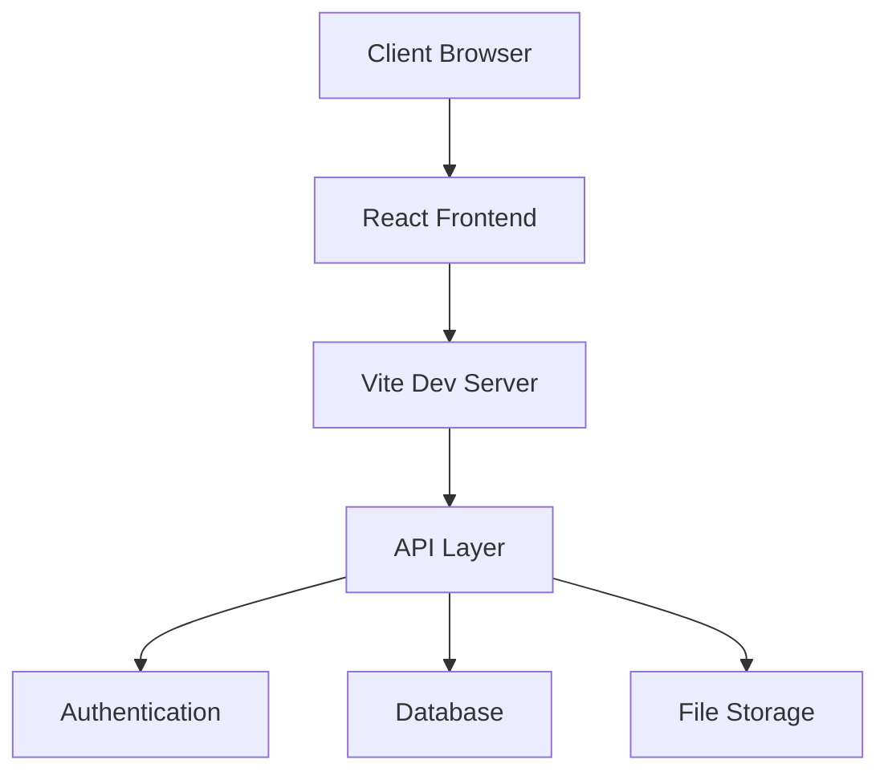

# Start Space Project Documentation

## 1. Project Overview

### Project Name and Description
**Start Space** is a comprehensive platform designed to support and accelerate startups and entrepreneurs in Mozambique, with a focus on integrating Christian values and business excellence. The platform serves as a hub for entrepreneurial development, offering mentorship, networking opportunities, and resources.

### Key Objectives and Goals
- Create a vibrant entrepreneurial ecosystem in Mozambique
- Provide high-quality mentorship and acceleration programs
- Foster connections between entrepreneurs and investors
- Promote business practices aligned with Christian values
- Support economic growth and job creation in the region

### Target Audience
- Early-stage startup founders
- Established entrepreneurs seeking growth
- Angel investors and venture capitalists
- Business mentors and advisors
- Community members interested in entrepreneurship

### Project Timeline and Milestones
1. **Phase 1: Platform Launch** (Q1 2024)
   - Website launch
   - Basic content implementation
   - User authentication system

2. **Phase 2: Community Features** (Q2 2024)
   - Mentorship platform
   - Event management system
   - Community forums

3. **Phase 3: Resource Center** (Q3 2024)
   - Learning management system
   - Resource library
   - Analytics dashboard

4. **Phase 4: Investment Platform** (Q4 2024)
   - Investor matching system
   - Startup portfolio management
   - Due diligence tools

## 2. Technical Architecture

### System Design


### Technology Stack
- **Frontend**
  - React 18.3.1
  - TypeScript
  - Vite
  - Tailwind CSS
  - Lucide React (icons)

- **State Management**
  - React Context API
  - Custom hooks

- **Routing**
  - React Router DOM

- **Internationalization**
  - Custom i18n implementation
  - Language context

### Dependencies
```json
{
  "dependencies": {
    "date-fns": "^2.30.0",
    "lucide-react": "^0.344.0",
    "react": "^18.3.1",
    "react-dom": "^18.3.1",
    "react-router-dom": "^6.22.3"
  },
  "devDependencies": {
    "@types/react": "^18.3.5",
    "@types/react-dom": "^18.3.0",
    "@vitejs/plugin-react": "^4.3.1",
    "autoprefixer": "^10.4.18",
    "postcss": "^8.4.35",
    "tailwindcss": "^3.4.1",
    "typescript": "^5.5.3",
    "vite": "^5.4.2"
  }
}
```

### Infrastructure
- Netlify for hosting and deployment
- Git for version control
- Environment-based configuration

## 3. Development Guidelines

### Coding Standards

#### TypeScript
- Use TypeScript for all new code
- Strict mode enabled
- Explicit type annotations for function parameters and returns
- Interface-first approach for data structures

```typescript
interface ServiceProps {
  title: string;
  description: string;
  icon: LucideIcon;
  onClick: () => void;
}
```

#### React Components
- Functional components with hooks
- Props interface definitions
- Meaningful component names
- Component organization by feature

```typescript
const ServiceCard: React.FC<ServiceProps> = ({ title, description, icon: Icon, onClick }) => {
  return (
    <div className="service-card" onClick={onClick}>
      <Icon className="icon" />
      <h3>{title}</h3>
      <p>{description}</p>
    </div>
  );
};
```

### Git Workflow
- **Main Branch**: Production-ready code
- **Develop Branch**: Integration branch
- **Feature Branches**: Format: `feature/feature-name`
- **Hotfix Branches**: Format: `hotfix/issue-description`

#### Commit Message Format
```
type(scope): description

[optional body]

[optional footer]
```

Types:
- feat: New feature
- fix: Bug fix
- docs: Documentation
- style: Formatting
- refactor: Code restructuring
- test: Adding tests
- chore: Maintenance

### Testing Requirements
- Unit tests for components
- Integration tests for features
- E2E tests for critical paths
- Accessibility testing
- Performance testing

### Deployment Process
1. Code review and approval
2. Automated tests passing
3. Staging deployment
4. QA verification
5. Production deployment via Netlify

## 4. Features and Functionality

### Core Features
1. **Multi-language Support**
   - English and Portuguese
   - Language switcher
   - Localized content

2. **Responsive Design**
   - Mobile-first approach
   - Adaptive layouts
   - Touch-friendly interactions

3. **Content Management**
   - Dynamic content loading
   - SEO optimization
   - Media optimization

4. **User Engagement**
   - Contact forms
   - Newsletter subscription
   - Social media integration

### User Stories

#### Language Selection
```gherkin
Feature: Language Selection
  As a user
  I want to switch between languages
  So that I can view content in my preferred language

  Scenario: User switches language
    Given I am on any page
    When I click the language selector
    And I select a different language
    Then the content should update to the selected language
```

## 5. UI/UX Design

### Design System

#### Colors
```javascript
colors: {
  primary: '#1211ca',    // Primary blue
  accent: '#f9af08',     // Gold accent
  'text-primary': '#000000',
  'bg-primary': '#ffffff',
  'bg-secondary': '#f8f9fa',
  'footer': {
    bg: '#1211ca',
    text: '#ffffff',
    accent: '#f9af08'
  }
}
```

#### Typography
```css
fontFamily: {
  heading: ['Poppins', 'sans-serif'],
  body: ['Open Sans', 'sans-serif'],
}
```

#### Component Examples
- Buttons
```jsx
<Button 
  variant="primary"
  className="bg-primary hover:bg-primary/90 text-white"
>
  Primary Button
</Button>
```

- Cards
```jsx
<div className="bg-white p-6 rounded-xl shadow-lg hover:shadow-xl transition-all">
  <h3 className="font-heading text-xl font-bold">Card Title</h3>
  <p className="text-gray-600">Card content</p>
</div>
```

### Responsive Breakpoints
```javascript
screens: {
  'sm': '640px',
  'md': '768px',
  'lg': '1024px',
  'xl': '1280px',
  '2xl': '1536px',
}
```

## 6. Security Considerations

### Authentication
- Email-based authentication
- Secure password requirements
- Session management
- CSRF protection

### Data Protection
- HTTPS enforcement
- Input sanitization
- XSS prevention
- CORS configuration

### Security Headers
```javascript
{
  'Content-Security-Policy': "default-src 'self'",
  'X-Frame-Options': 'DENY',
  'X-Content-Type-Options': 'nosniff',
  'Referrer-Policy': 'strict-origin-when-cross-origin'
}
```

## 7. Performance Requirements

### Performance Metrics
- First Contentful Paint (FCP) < 1.8s
- Time to Interactive (TTI) < 3.8s
- Cumulative Layout Shift (CLS) < 0.1
- First Input Delay (FID) < 100ms

### Optimization Strategies
1. **Asset Optimization**
   - Image optimization
   - Code splitting
   - Tree shaking
   - Lazy loading

2. **Caching**
   - Browser caching
   - Static asset caching
   - API response caching

3. **Performance Monitoring**
   - Real User Monitoring (RUM)
   - Synthetic monitoring
   - Performance budgets

## 8. Maintenance and Support

### Monitoring
- Error tracking
- Performance monitoring
- User analytics
- Server monitoring

### Backup Procedures
1. Daily database backups
2. Weekly full system backups
3. Monthly archive backups
4. Disaster recovery testing

### Support Contacts
- **Technical Lead**: [Contact Information]
- **Project Manager**: [Contact Information]
- **Support Team**: [Contact Information]

### Troubleshooting Guidelines
1. Check error logs
2. Verify configuration
3. Test in staging environment
4. Review recent changes
5. Contact appropriate team member

## Version History

| Version | Date | Description | Author |
|---------|------|-------------|---------|
| 1.0.0 | 2024-03-07 | Initial documentation | Start Space Team |

---

*This documentation is maintained by the Start Space development team and should be updated as the project evolves.*
